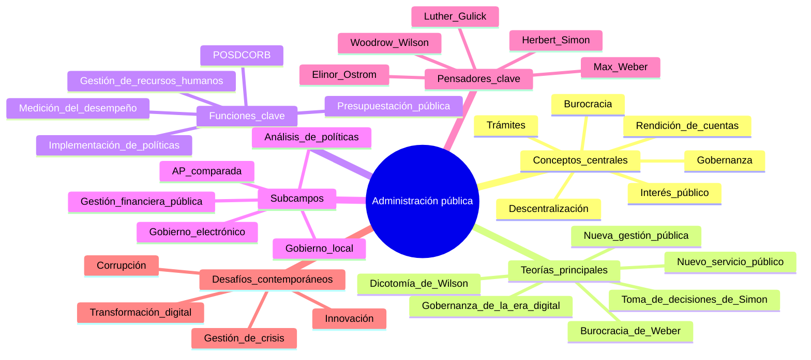

```mermaid
mindmap
  root((Administración pública))
    Conceptos_centrales
      Interés_público
      Rendición_de_cuentas
      Burocracia
      Trámites
      Descentralización
      Gobernanza
    Teorías_principales
      Dicotomía_de_Wilson
      Burocracia_de_Weber
      Toma_de_decisiones_de_Simon
      Nueva_gestión_pública
      Nuevo_servicio_público
      Gobernanza_de_la_era_digital
    Funciones_clave
      POSDCORB
      Implementación_de_políticas
      Presupuestación_pública
      Gestión_de_recursos_humanos
      Medición_del_desempeño
    Subcampos
      AP_comparada
      Análisis_de_políticas
      Gestión_financiera_pública
      Gobierno_electrónico
      Gobierno_local
    Pensadores_clave
      Woodrow_Wilson
      Max_Weber
      Luther_Gulick
      Herbert_Simon
      Elinor_Ostrom
    Desafíos_contemporáneos
      Corrupción
      Innovación
      Gestión_de_crisis
      Transformación_digital
```
