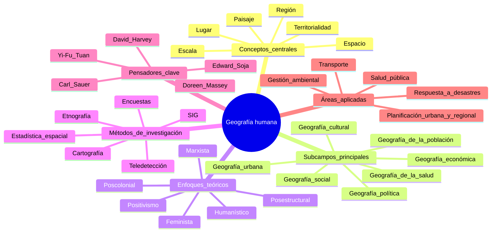

```mermaid
mindmap
  root((Geografía humana))
    Conceptos_centrales
      Espacio
      Lugar
      Escala
      Región
      Paisaje
      Territorialidad
    Subcampos_principales
      Geografía_cultural
      Geografía_económica
      Geografía_política
      Geografía_urbana
      Geografía_social
      Geografía_de_la_población
      Geografía_de_la_salud
    Enfoques_teóricos
      Positivismo
      Humanístico
      Marxista
      Feminista
      Posestructural
      Poscolonial
    Métodos_de_investigación
      SIG
      Cartografía
      Teledetección
      Etnografía
      Encuestas
      Estadística_espacial
    Pensadores_clave
      Carl_Sauer
      David_Harvey
      Doreen_Massey
      Yi-Fu_Tuan
      Edward_Soja
    Áreas_aplicadas
      Planificación_urbana_y_regional
      Gestión_ambiental
      Transporte
      Respuesta_a_desastres
      Salud_pública
```
