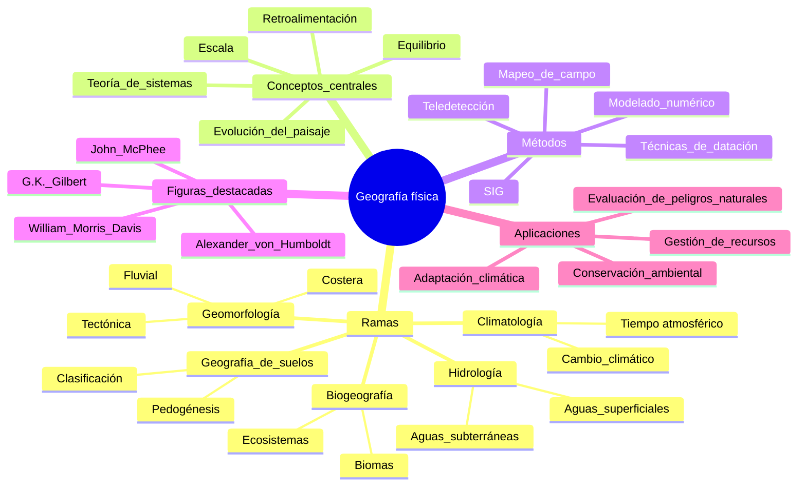

```mermaid
mindmap
  root((Geografía física))
    Ramas
      Geomorfología
        Tectónica
        Fluvial
        Costera
      Climatología
        Tiempo atmosférico
        Cambio_climático
      Biogeografía
        Ecosistemas
        Biomas
      Hidrología
        Aguas_superficiales
        Aguas_subterráneas
      Geografía_de_suelos
        Pedogénesis
        Clasificación
    Conceptos_centrales
      Teoría_de_sistemas
      Retroalimentación
      Equilibrio
      Evolución_del_paisaje
      Escala
    Métodos
      Mapeo_de_campo
      Teledetección
      SIG
      Modelado_numérico
      Técnicas_de_datación
    Figuras_destacadas
      Alexander_von_Humboldt
      William_Morris_Davis
      G.K._Gilbert
      John_McPhee
    Aplicaciones
      Evaluación_de_peligros_naturales
      Conservación_ambiental
      Adaptación_climática
      Gestión_de_recursos
```
