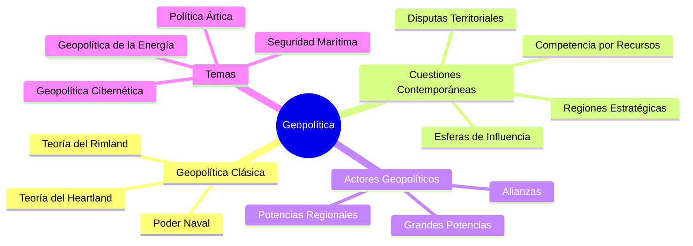

```mermaid
mindmap
  root((Geopolítica))
    Geopolítica Clásica
      Teoría del Heartland
      Teoría del Rimland
      Poder Naval
    Cuestiones Contemporáneas
      Competencia por Recursos
      Disputas Territoriales
      Regiones Estratégicas
      Esferas de Influencia
    Actores Geopolíticos
      Grandes Potencias
      Potencias Regionales
      Alianzas
    Temas
      Geopolítica de la Energía
      Política Ártica
      Seguridad Marítima
      Geopolítica Cibernética
```
