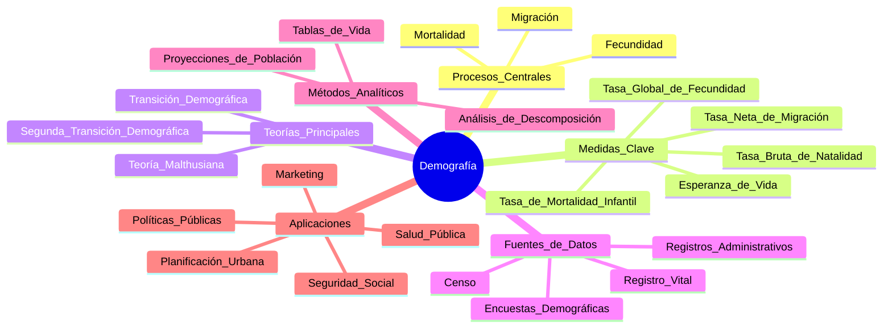

```mermaid
mindmap
  root((Demografía))
    Procesos_Centrales
      Fecundidad
      Mortalidad
      Migración
    Medidas_Clave
      Tasa_Bruta_de_Natalidad
      Tasa_Global_de_Fecundidad
      Esperanza_de_Vida
      Tasa_de_Mortalidad_Infantil
      Tasa_Neta_de_Migración
    Teorías_Principales
      Teoría_Malthusiana
      Transición_Demográfica
      Segunda_Transición_Demográfica
    Fuentes_de_Datos
      Censo
      Registro_Vital
      Encuestas_Demográficas
      Registros_Administrativos
    Métodos_Analíticos
      Tablas_de_Vida
      Proyecciones_de_Población
      Análisis_de_Descomposición
    Aplicaciones
      Políticas_Públicas
      Seguridad_Social
      Planificación_Urbana
      Salud_Pública
      Marketing
```
