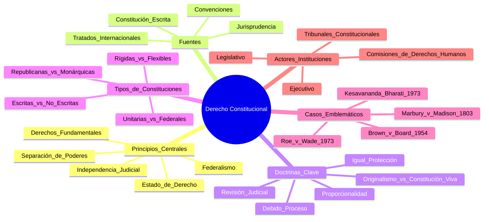

```mermaid
mindmap
  root((Derecho Constitucional))
    Principios_Centrales
      Estado_de_Derecho
      Separación_de_Poderes
      Federalismo
      Independencia_Judicial
      Derechos_Fundamentales
    Fuentes
      Constitución_Escrita
      Jurisprudencia
      Convenciones
      Tratados_Internacionales
    Doctrinas_Clave
      Revisión_Judicial
      Debido_Proceso
      Igual_Protección
      Proporcionalidad
      Originalismo_vs_Constitución_Viva
    Tipos_de_Constituciones
      Escritas_vs_No_Escritas
      Rígidas_vs_Flexibles
      Unitarias_vs_Federales
      Republicanas_vs_Monárquicas
    Casos_Emblemáticos
      Marbury_v_Madison_1803
      Brown_v_Board_1954
      Roe_v_Wade_1973
      Kesavananda_Bharati_1973
    Actores_Instituciones
      Tribunales_Constitucionales
      Legislativo
      Ejecutivo
      Comisiones_de_Derechos_Humanos
```
