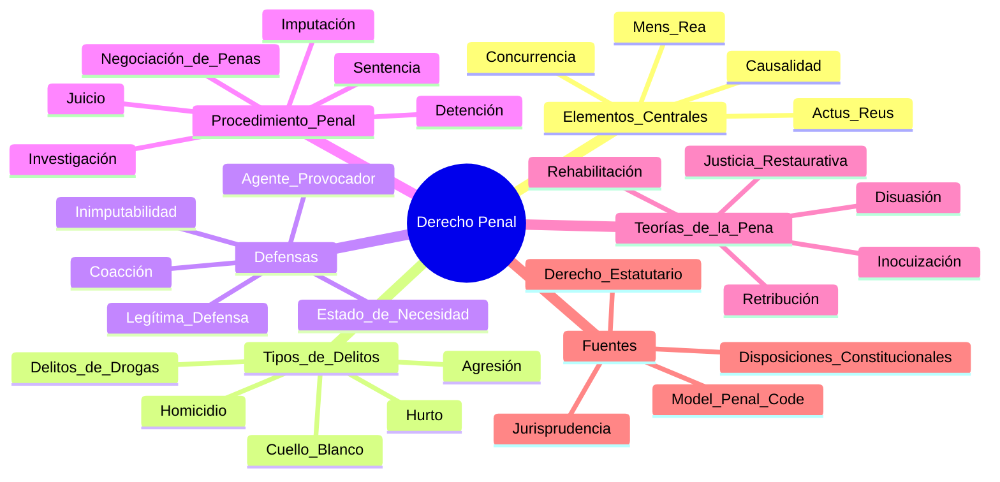

```mermaid
mindmap
  root((Derecho Penal))
    Elementos_Centrales
      Actus_Reus
      Mens_Rea
      Concurrencia
      Causalidad
    Tipos_de_Delitos
      Homicidio
      Hurto
      Agresión
      Delitos_de_Drogas
      Cuello_Blanco
    Defensas
      Legítima_Defensa
      Inimputabilidad
      Coacción
      Estado_de_Necesidad
      Agente_Provocador
    Procedimiento_Penal
      Investigación
      Detención
      Imputación
      Negociación_de_Penas
      Juicio
      Sentencia
    Teorías_de_la_Pena
      Retribución
      Disuasión
      Inocuización
      Rehabilitación
      Justicia_Restaurativa
    Fuentes
      Derecho_Estatutario
      Jurisprudencia
      Model_Penal_Code
      Disposiciones_Constitucionales
```
