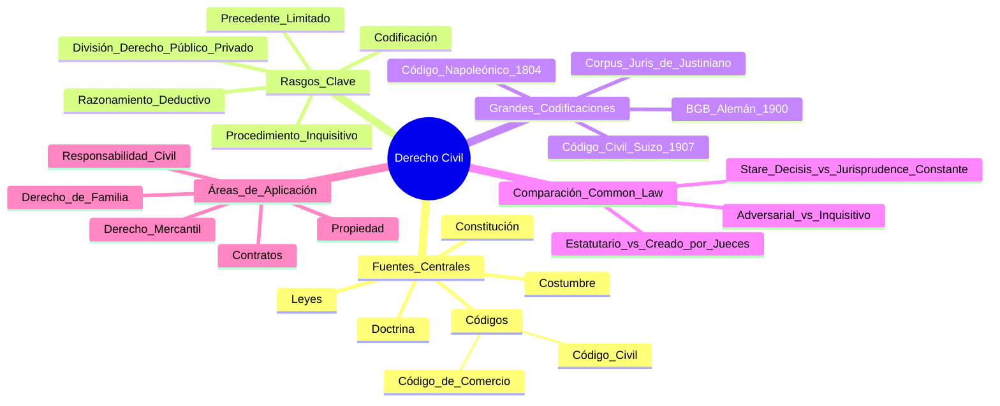

```mermaid
mindmap
  root((Derecho Civil))
    Fuentes_Centrales
      Constitución
      Códigos
        Código_Civil
        Código_de_Comercio
      Leyes
      Costumbre
      Doctrina
    Rasgos_Clave
      Codificación
      Razonamiento_Deductivo
      Precedente_Limitado
      Procedimiento_Inquisitivo
      División_Derecho_Público_Privado
    Grandes_Codificaciones
      Corpus_Juris_de_Justiniano
      Código_Napoleónico_1804
      BGB_Alemán_1900
      Código_Civil_Suizo_1907
    Comparación_Common_Law
      Estatutario_vs_Creado_por_Jueces
      Adversarial_vs_Inquisitivo
      Stare_Decisis_vs_Jurisprudence_Constante
    Áreas_de_Aplicación
      Contratos
      Responsabilidad_Civil
      Propiedad
      Derecho_de_Familia
      Derecho_Mercantil
```
