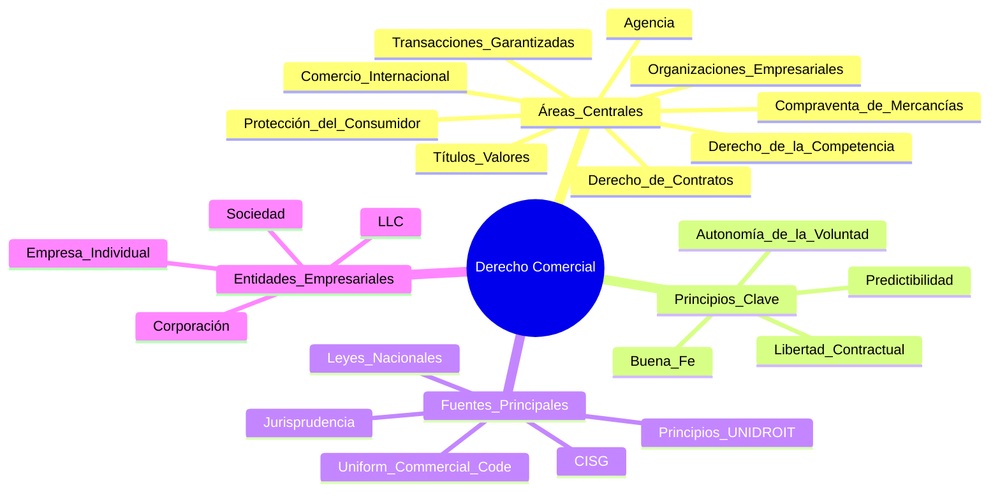

```mermaid
mindmap
  root((Derecho Comercial))
    Áreas_Centrales
      Derecho_de_Contratos
      Compraventa_de_Mercancías
      Transacciones_Garantizadas
      Títulos_Valores
      Organizaciones_Empresariales
      Agencia
      Derecho_de_la_Competencia
      Protección_del_Consumidor
      Comercio_Internacional
    Principios_Clave
      Libertad_Contractual
      Buena_Fe
      Autonomía_de_la_Voluntad
      Predictibilidad
    Fuentes_Principales
      Uniform_Commercial_Code
      Leyes_Nacionales
      Jurisprudencia
      CISG
      Principios_UNIDROIT
    Entidades_Empresariales
      Empresa_Individual
      Sociedad
      Corporación
      LLC
```
