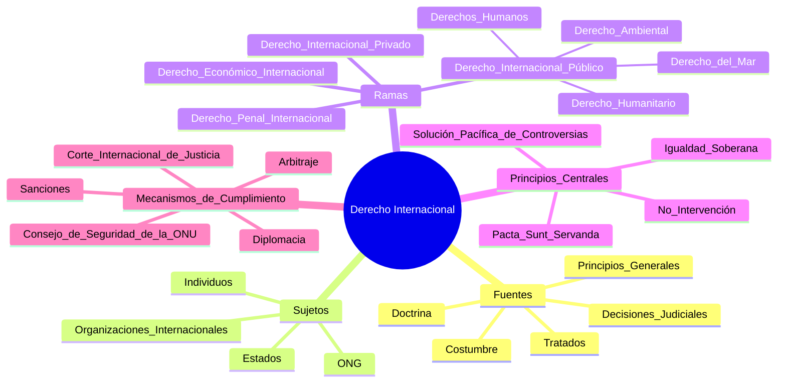

```mermaid
mindmap
  root((Derecho Internacional))
    Fuentes
      Tratados
      Costumbre
      Principios_Generales
      Decisiones_Judiciales
      Doctrina
    Sujetos
      Estados
      Organizaciones_Internacionales
      Individuos
      ONG
    Ramas
      Derecho_Internacional_Público
        Derecho_del_Mar
        Derecho_Humanitario
        Derechos_Humanos
        Derecho_Ambiental
      Derecho_Internacional_Privado
      Derecho_Penal_Internacional
      Derecho_Económico_Internacional
    Principios_Centrales
      Igualdad_Soberana
      No_Intervención
      Pacta_Sunt_Servanda
      Solución_Pacífica_de_Controversias
    Mecanismos_de_Cumplimiento
      Corte_Internacional_de_Justicia
      Arbitraje
      Consejo_de_Seguridad_de_la_ONU
      Sanciones
      Diplomacia
```
