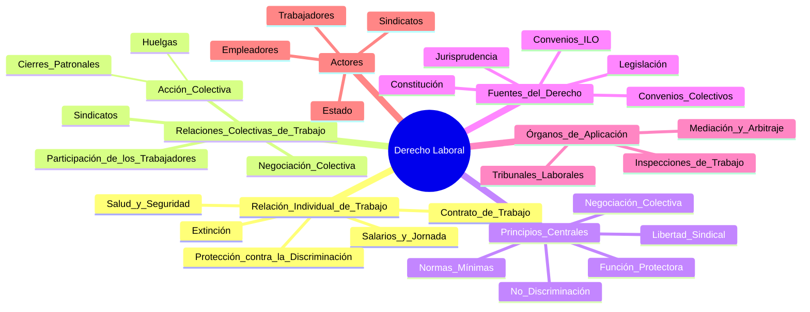

```mermaid
mindmap
  root((Derecho Laboral))
    Relación_Individual_de_Trabajo
      Contrato_de_Trabajo
      Salarios_y_Jornada
      Salud_y_Seguridad
      Protección_contra_la_Discriminación
      Extinción
    Relaciones_Colectivas_de_Trabajo
      Sindicatos
      Negociación_Colectiva
      Acción_Colectiva
        Huelgas
        Cierres_Patronales
      Participación_de_los_Trabajadores
    Principios_Centrales
      Función_Protectora
      No_Discriminación
      Libertad_Sindical
      Negociación_Colectiva
      Normas_Mínimas
    Fuentes_del_Derecho
      Constitución
      Legislación
      Convenios_Colectivos
      Convenios_ILO
      Jurisprudencia
    Órganos_de_Aplicación
      Inspecciones_de_Trabajo
      Tribunales_Laborales
      Mediación_y_Arbitraje
    Actores
      Trabajadores
      Empleadores
      Sindicatos
      Estado
```
