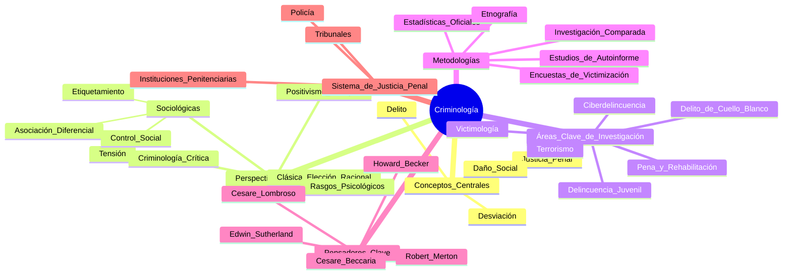

```mermaid
mindmap
  root((Criminología))
    Conceptos_Centrales
      Delito
      Desviación
      Justicia_Penal
      Daño_Social
    Perspectivas_Teóricas
      Clásica_Elección_Racional
      Positivismo_Biológico
      Rasgos_Psicológicos
      Sociológicas
        Tensión
        Asociación_Diferencial
        Control_Social
        Etiquetamiento
      Criminología_Crítica
    Áreas_Clave_de_Investigación
      Victimología
      Delincuencia_Juvenil
      Delito_de_Cuello_Blanco
      Ciberdelincuencia
      Terrorismo
      Pena_y_Rehabilitación
    Metodologías
      Encuestas_de_Victimización
      Estudios_de_Autoinforme
      Estadísticas_Oficiales
      Etnografía
      Investigación_Comparada
    Pensadores_Clave
      Cesare_Beccaria
      Cesare_Lombroso
      Edwin_Sutherland
      Robert_Merton
      Howard_Becker
    Sistema_de_Justicia_Penal
      Policía
      Tribunales
      Instituciones_Penitenciarias
```
