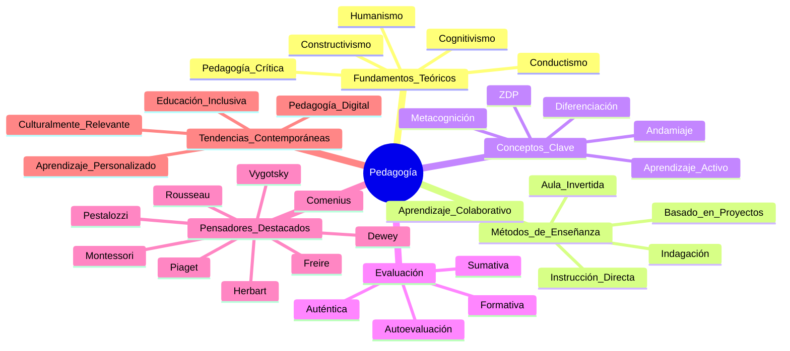

```mermaid
mindmap
  root((Pedagogía))
    Fundamentos_Teóricos
      Conductismo
      Cognitivismo
      Constructivismo
      Humanismo
      Pedagogía_Crítica
    Métodos_de_Enseñanza
      Instrucción_Directa
      Aprendizaje_Colaborativo
      Basado_en_Proyectos
      Indagación
      Aula_Invertida
    Conceptos_Clave
      Andamiaje
      ZDP
      Diferenciación
      Aprendizaje_Activo
      Metacognición
    Evaluación
      Formativa
      Sumativa
      Auténtica
      Autoevaluación
    Pensadores_Destacados
      Comenius
      Rousseau
      Pestalozzi
      Herbart
      Dewey
      Montessori
      Piaget
      Vygotsky
      Freire
    Tendencias_Contemporáneas
      Pedagogía_Digital
      Educación_Inclusiva
      Culturalmente_Relevante
      Aprendizaje_Personalizado
```
