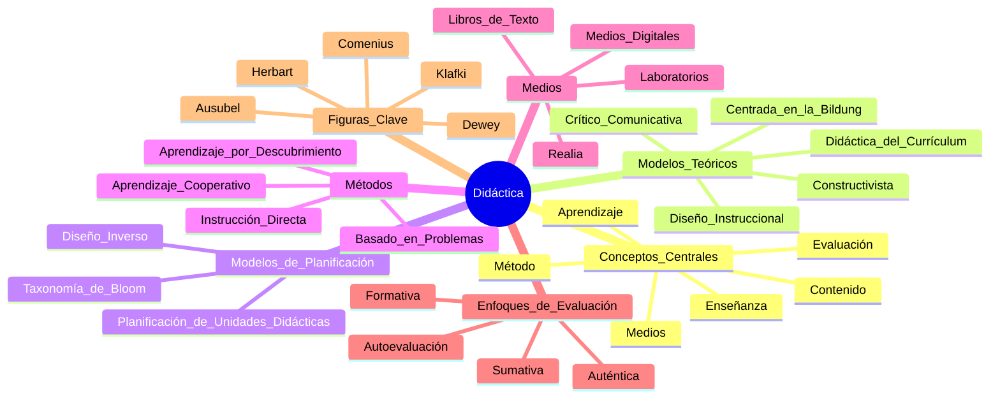

```mermaid
mindmap
  root((Didáctica))
    Conceptos_Centrales
      Enseñanza
      Aprendizaje
      Contenido
      Método
      Medios
      Evaluación
    Modelos_Teóricos
      Centrada_en_la_Bildung
      Constructivista
      Crítico_Comunicativa
      Didáctica_del_Currículum
      Diseño_Instruccional
    Modelos_de_Planificación
      Taxonomía_de_Bloom
      Diseño_Inverso
      Planificación_de_Unidades_Didácticas
    Métodos
      Instrucción_Directa
      Aprendizaje_por_Descubrimiento
      Aprendizaje_Cooperativo
      Basado_en_Problemas
    Medios
      Libros_de_Texto
      Medios_Digitales
      Laboratorios
      Realia
    Enfoques_de_Evaluación
      Formativa
      Sumativa
      Auténtica
      Autoevaluación
    Figuras_Clave
      Comenius
      Herbart
      Dewey
      Klafki
      Ausubel
```
