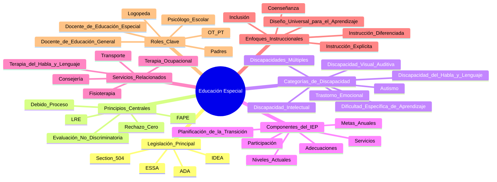

```mermaid
mindmap
  root((Educación Especial))
    Legislación_Principal
      IDEA
      Section_504
      ADA
      ESSA
    Principios_Centrales
      FAPE
      LRE
      Debido_Proceso
      Rechazo_Cero
      Evaluación_No_Discriminatoria
    Categorías_de_Discapacidad
      Autismo
      Discapacidad_Intelectual
      Dificultad_Específica_de_Aprendizaje
      Trastorno_Emocional
      Discapacidad_del_Habla_y_Lenguaje
      Discapacidad_Visual_Auditiva
      Discapacidades_Múltiples
    Componentes_del_IEP
      Niveles_Actuales
      Metas_Anuales
      Servicios
      Adecuaciones
      Participación
      Planificación_de_la_Transición
    Servicios_Relacionados
      Terapia_del_Habla_y_Lenguaje
      Terapia_Ocupacional
      Fisioterapia
      Consejería
      Transporte
    Enfoques_Instruccionales
      Instrucción_Diferenciada
      Diseño_Universal_para_el_Aprendizaje
      Coenseñanza
      Inclusión
      Instrucción_Explícita
    Roles_Clave
      Docente_de_Educación_Especial
      Docente_de_Educación_General
      Psicólogo_Escolar
      Logopeda
      OT_PT
      Padres
```
