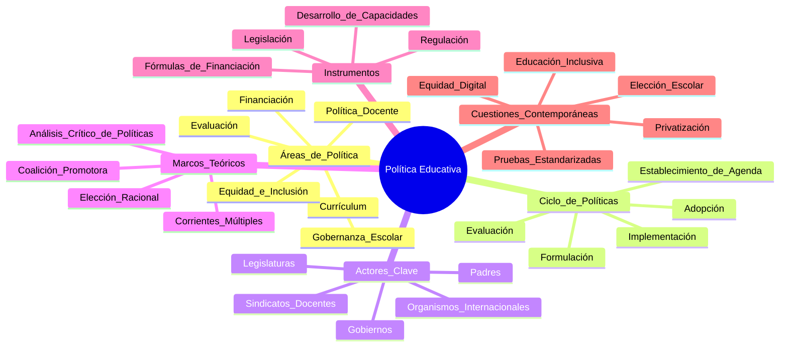

```mermaid
mindmap
  root((Política Educativa))
    Áreas_de_Política
      Financiación
      Currículum
      Política_Docente
      Evaluación
      Equidad_e_Inclusión
      Gobernanza_Escolar
    Ciclo_de_Políticas
      Establecimiento_de_Agenda
      Formulación
      Adopción
      Implementación
      Evaluación
    Actores_Clave
      Gobiernos
      Legislaturas
      Sindicatos_Docentes
      Padres
      Organismos_Internacionales
    Marcos_Teóricos
      Elección_Racional
      Corrientes_Múltiples
      Coalición_Promotora
      Análisis_Crítico_de_Políticas
    Instrumentos
      Legislación
      Fórmulas_de_Financiación
      Regulación
      Desarrollo_de_Capacidades
    Cuestiones_Contemporáneas
      Privatización
      Elección_Escolar
      Equidad_Digital
      Pruebas_Estandarizadas
      Educación_Inclusiva
```
