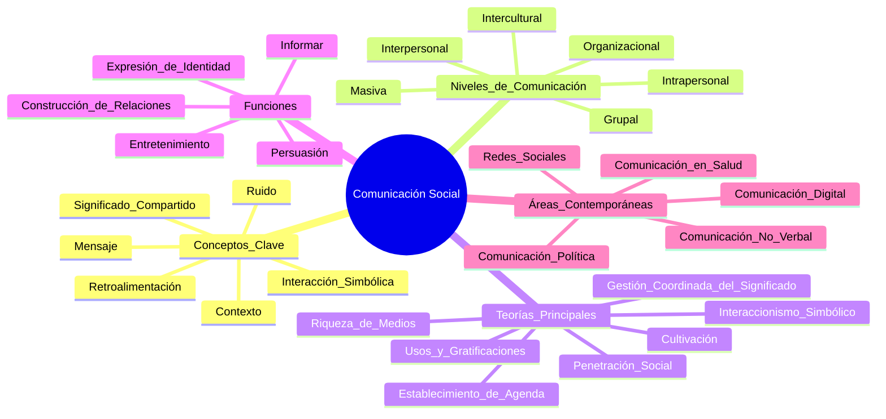

```mermaid
mindmap
  root((Comunicación Social))
    Conceptos_Clave
      Mensaje
      Retroalimentación
      Ruido
      Contexto
      Significado_Compartido
      Interacción_Simbólica
    Niveles_de_Comunicación
      Intrapersonal
      Interpersonal
      Grupal
      Organizacional
      Masiva
      Intercultural
    Teorías_Principales
      Interaccionismo_Simbólico
      Gestión_Coordinada_del_Significado
      Penetración_Social
      Riqueza_de_Medios
      Usos_y_Gratificaciones
      Establecimiento_de_Agenda
      Cultivación
    Funciones
      Informar
      Construcción_de_Relaciones
      Expresión_de_Identidad
      Persuasión
      Entretenimiento
    Áreas_Contemporáneas
      Comunicación_Digital
      Redes_Sociales
      Comunicación_en_Salud
      Comunicación_Política
      Comunicación_No_Verbal
```
