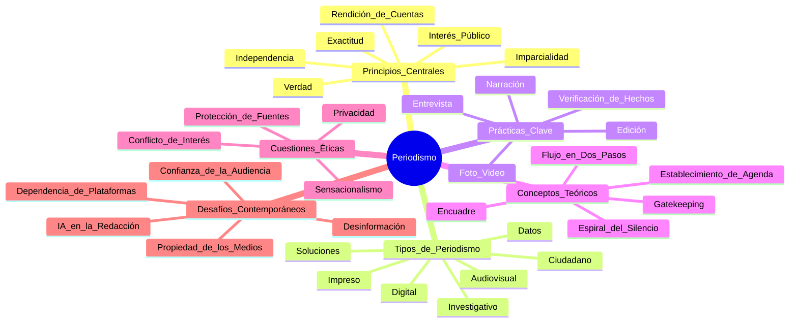

```mermaid
mindmap
  root((Periodismo))
    Principios_Centrales
      Verdad
      Exactitud
      Imparcialidad
      Independencia
      Rendición_de_Cuentas
      Interés_Público
    Tipos_de_Periodismo
      Investigativo
      Datos
      Audiovisual
      Impreso
      Digital
      Soluciones
      Ciudadano
    Prácticas_Clave
      Entrevista
      Verificación_de_Hechos
      Edición
      Narración
      Foto_Video
    Conceptos_Teóricos
      Gatekeeping
      Establecimiento_de_Agenda
      Encuadre
      Flujo_en_Dos_Pasos
      Espiral_del_Silencio
    Cuestiones_Éticas
      Privacidad
      Conflicto_de_Interés
      Protección_de_Fuentes
      Sensacionalismo
    Desafíos_Contemporáneos
      Desinformación
      Propiedad_de_los_Medios
      Dependencia_de_Plataformas
      IA_en_la_Redacción
      Confianza_de_la_Audiencia
```
