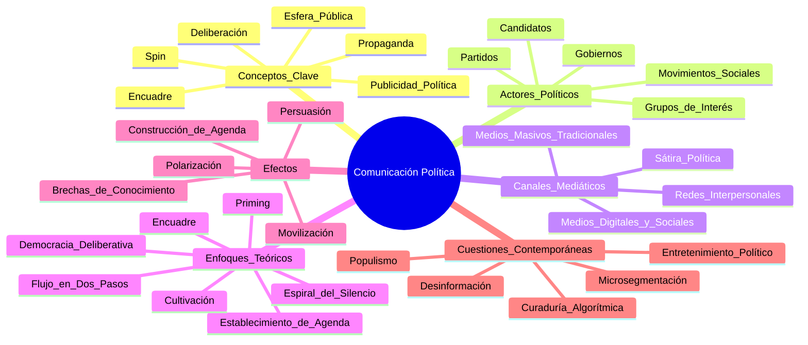

```mermaid
mindmap
  root((Comunicación Política))
    Conceptos_Clave
      Propaganda
      Esfera_Pública
      Publicidad_Política
      Spin
      Encuadre
      Deliberación
    Actores_Políticos
      Candidatos
      Partidos
      Gobiernos
      Grupos_de_Interés
      Movimientos_Sociales
    Canales_Mediáticos
      Medios_Masivos_Tradicionales
      Medios_Digitales_y_Sociales
      Redes_Interpersonales
      Sátira_Política
    Enfoques_Teóricos
      Establecimiento_de_Agenda
      Priming
      Encuadre
      Espiral_del_Silencio
      Flujo_en_Dos_Pasos
      Cultivación
      Democracia_Deliberativa
    Efectos
      Persuasión
      Construcción_de_Agenda
      Polarización
      Movilización
      Brechas_de_Conocimiento
    Cuestiones_Contemporáneas
      Desinformación
      Curaduría_Algorítmica
      Microsegmentación
      Populismo
      Entretenimiento_Político
```
