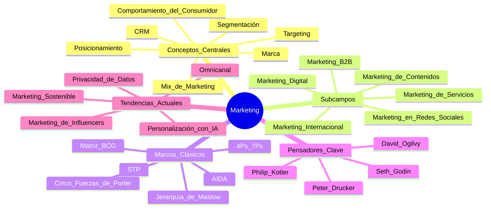

```mermaid
mindmap
  root((Marketing))
    Conceptos_Centrales
      Mix_de_Marketing
      Segmentación
      Targeting
      Posicionamiento
      Marca
      Comportamiento_del_Consumidor
      CRM
    Subcampos
      Marketing_Digital
      Marketing_de_Contenidos
      Marketing_en_Redes_Sociales
      Marketing_B2B
      Marketing_Internacional
      Marketing_de_Servicios
    Marcos_Clásicos
      4Ps_7Ps
      STP
      AIDA
      Jerarquía_de_Maslow
      Cinco_Fuerzas_de_Porter
      Matriz_BCG
    Pensadores_Clave
      Philip_Kotler
      Peter_Drucker
      David_Ogilvy
      Seth_Godin
    Tendencias_Actuales
      Personalización_con_IA
      Marketing_Sostenible
      Marketing_de_Influencers
      Omnicanal
      Privacidad_de_Datos
```
