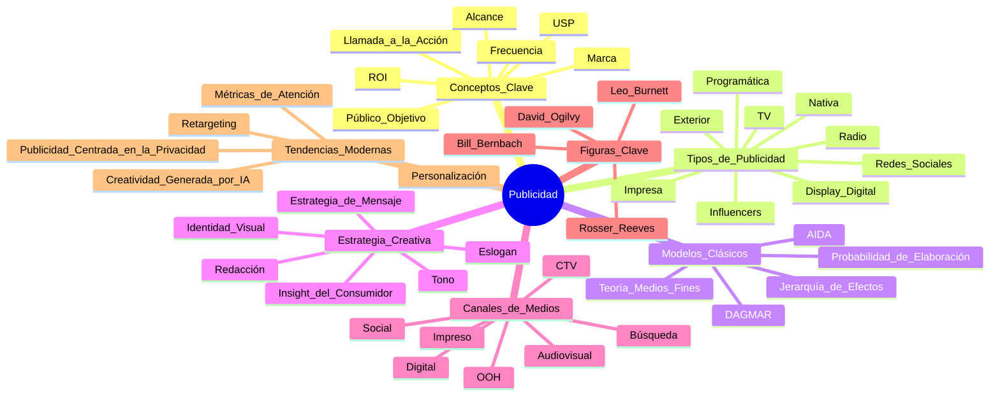

```mermaid
mindmap
  root((Publicidad))
    Conceptos_Clave
      Público_Objetivo
      Marca
      USP
      Alcance
      Frecuencia
      ROI
      Llamada_a_la_Acción
    Tipos_de_Publicidad
      TV
      Radio
      Impresa
      Exterior
      Display_Digital
      Redes_Sociales
      Nativa
      Influencers
      Programática
    Modelos_Clásicos
      AIDA
      DAGMAR
      Probabilidad_de_Elaboración
      Jerarquía_de_Efectos
      Teoría_Medios_Fines
    Estrategia_Creativa
      Insight_del_Consumidor
      Estrategia_de_Mensaje
      Tono
      Eslogan
      Identidad_Visual
      Redacción
    Canales_de_Medios
      Audiovisual
      Impreso
      OOH
      Digital
      Búsqueda
      Social
      CTV
    Figuras_Clave
      David_Ogilvy
      Bill_Bernbach
      Rosser_Reeves
      Leo_Burnett
    Tendencias_Modernas
      Personalización
      Creatividad_Generada_por_IA
      Retargeting
      Publicidad_Centrada_en_la_Privacidad
      Métricas_de_Atención
```
