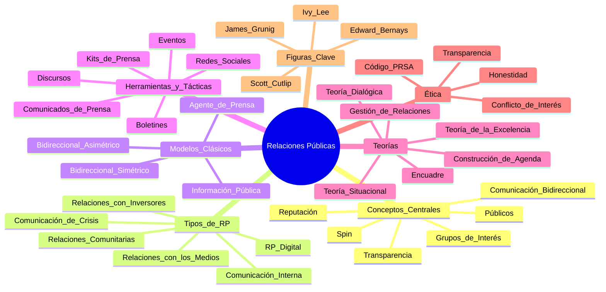

```mermaid
mindmap
  root((Relaciones Públicas))
    Conceptos_Centrales
      Reputación
      Grupos_de_Interés
      Públicos
      Comunicación_Bidireccional
      Transparencia
      Spin
    Tipos_de_RP
      Relaciones_con_los_Medios
      Comunicación_de_Crisis
      Comunicación_Interna
      Relaciones_con_Inversores
      Relaciones_Comunitarias
      RP_Digital
    Modelos_Clásicos
      Agente_de_Prensa
      Información_Pública
      Bidireccional_Asimétrico
      Bidireccional_Simétrico
    Herramientas_y_Tácticas
      Comunicados_de_Prensa
      Kits_de_Prensa
      Discursos
      Eventos
      Redes_Sociales
      Boletines
    Teorías
      Teoría_de_la_Excelencia
      Teoría_Situacional
      Encuadre
      Construcción_de_Agenda
      Teoría_Dialógica
      Gestión_de_Relaciones
    Ética
      Código_PRSA
      Transparencia
      Honestidad
      Conflicto_de_Interés
    Figuras_Clave
      Ivy_Lee
      Edward_Bernays
      James_Grunig
      Scott_Cutlip
```
