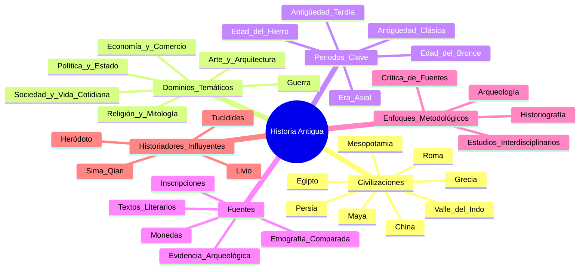

```mermaid
mindmap
  root((Historia Antigua))
    Civilizaciones
      Mesopotamia
      Egipto
      Valle_del_Indo
      China
      Grecia
      Roma
      Persia
      Maya
    Dominios_Temáticos
      Política_y_Estado
      Economía_y_Comercio
      Sociedad_y_Vida_Cotidiana
      Religión_y_Mitología
      Arte_y_Arquitectura
      Guerra
    Periodos_Clave
      Edad_del_Bronce
      Edad_del_Hierro
      Era_Axial
      Antigüedad_Clásica
      Antigüedad_Tardía
    Fuentes
      Evidencia_Arqueológica
      Textos_Literarios
      Inscripciones
      Monedas
      Etnografía_Comparada
    Enfoques_Metodológicos
      Historiografía
      Crítica_de_Fuentes
      Arqueología
      Estudios_Interdisciplinarios
    Historiadores_Influyentes
      Heródoto
      Tucídides
      Sima_Qian
      Livio
```
