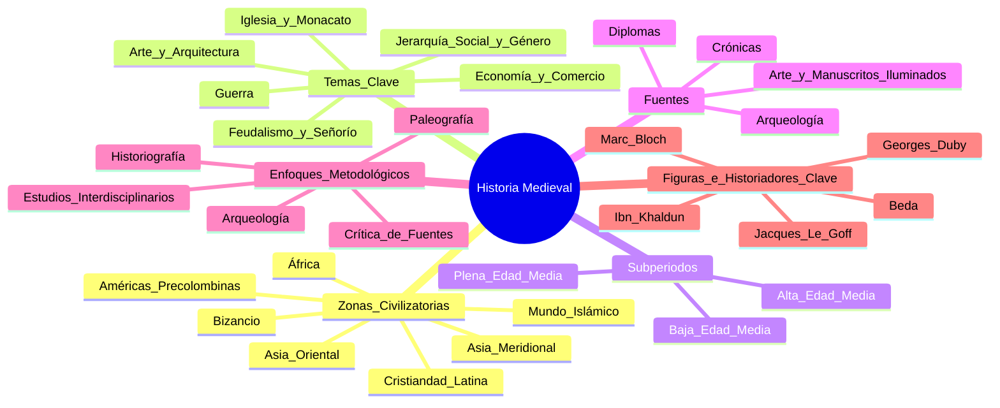

```mermaid
mindmap
  root((Historia Medieval))
    Zonas_Civilizatorias
      Cristiandad_Latina
      Bizancio
      Mundo_Islámico
      Asia_Oriental
      Asia_Meridional
      África
      Américas_Precolombinas
    Temas_Clave
      Feudalismo_y_Señorío
      Iglesia_y_Monacato
      Economía_y_Comercio
      Jerarquía_Social_y_Género
      Arte_y_Arquitectura
      Guerra
    Subperiodos
      Alta_Edad_Media
      Plena_Edad_Media
      Baja_Edad_Media
    Fuentes
      Crónicas
      Diplomas
      Arqueología
      Arte_y_Manuscritos_Iluminados
    Enfoques_Metodológicos
      Historiografía
      Crítica_de_Fuentes
      Paleografía
      Arqueología
      Estudios_Interdisciplinarios
    Figuras_e_Historiadores_Clave
      Beda
      Ibn_Khaldun
      Marc_Bloch
      Georges_Duby
      Jacques_Le_Goff
```
