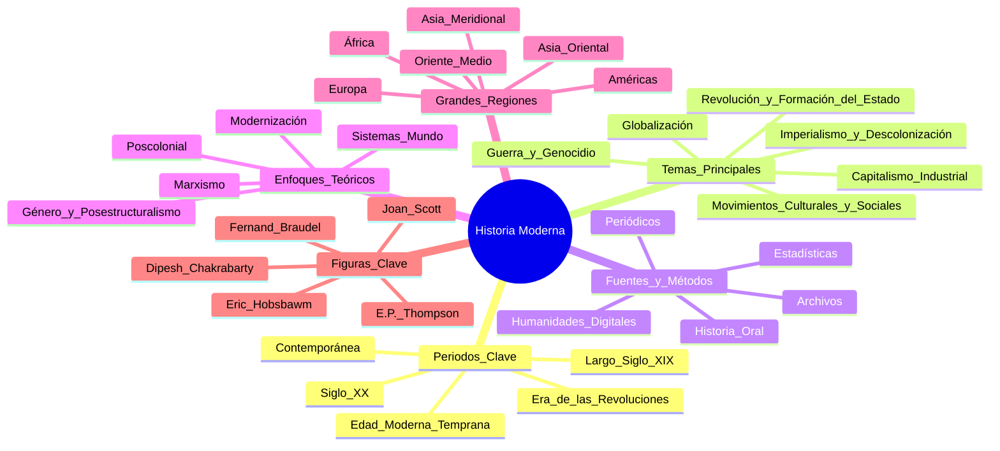

```mermaid
mindmap
  root((Historia Moderna))
    Periodos_Clave
      Edad_Moderna_Temprana
      Era_de_las_Revoluciones
      Largo_Siglo_XIX
      Siglo_XX
      Contemporánea
    Temas_Principales
      Revolución_y_Formación_del_Estado
      Capitalismo_Industrial
      Imperialismo_y_Descolonización
      Guerra_y_Genocidio
      Movimientos_Culturales_y_Sociales
      Globalización
    Fuentes_y_Métodos
      Archivos
      Periódicos
      Estadísticas
      Historia_Oral
      Humanidades_Digitales
    Enfoques_Teóricos
      Modernización
      Marxismo
      Sistemas_Mundo
      Poscolonial
      Género_y_Posestructuralismo
    Grandes_Regiones
      Europa
      Asia_Oriental
      Asia_Meridional
      Oriente_Medio
      África
      Américas
    Figuras_Clave
      Eric_Hobsbawm
      Fernand_Braudel
      E.P._Thompson
      Dipesh_Chakrabarty
      Joan_Scott
```
