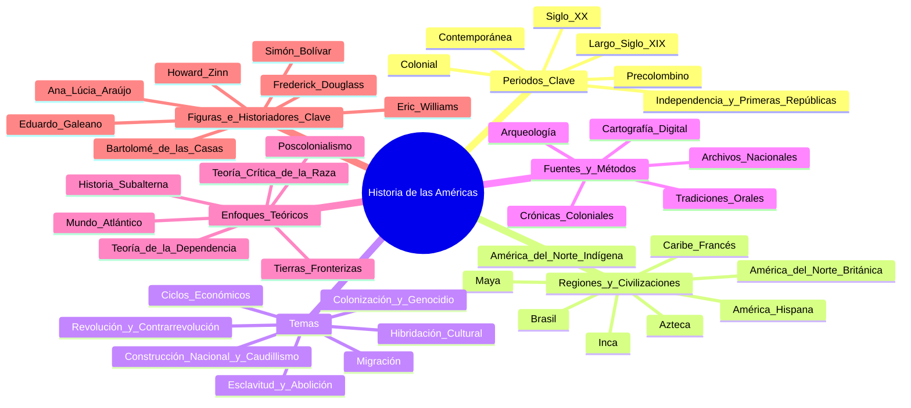

```mermaid
mindmap
  root((Historia de las Américas))
    Periodos_Clave
      Precolombino
      Colonial
      Independencia_y_Primeras_Repúblicas
      Largo_Siglo_XIX
      Siglo_XX
      Contemporánea
    Regiones_y_Civilizaciones
      Maya
      Azteca
      Inca
      América_Hispana
      Brasil
      América_del_Norte_Británica
      Caribe_Francés
      América_del_Norte_Indígena
    Temas
      Colonización_y_Genocidio
      Esclavitud_y_Abolición
      Construcción_Nacional_y_Caudillismo
      Ciclos_Económicos
      Migración
      Revolución_y_Contrarrevolución
      Hibridación_Cultural
    Fuentes_y_Métodos
      Arqueología
      Crónicas_Coloniales
      Archivos_Nacionales
      Tradiciones_Orales
      Cartografía_Digital
    Enfoques_Teóricos
      Poscolonialismo
      Teoría_de_la_Dependencia
      Mundo_Atlántico
      Tierras_Fronterizas
      Historia_Subalterna
      Teoría_Crítica_de_la_Raza
    Figuras_e_Historiadores_Clave
      Bartolomé_de_las_Casas
      Simón_Bolívar
      Frederick_Douglass
      Eric_Williams
      Eduardo_Galeano
      Howard_Zinn
      Ana_Lúcia_Araújo
```
