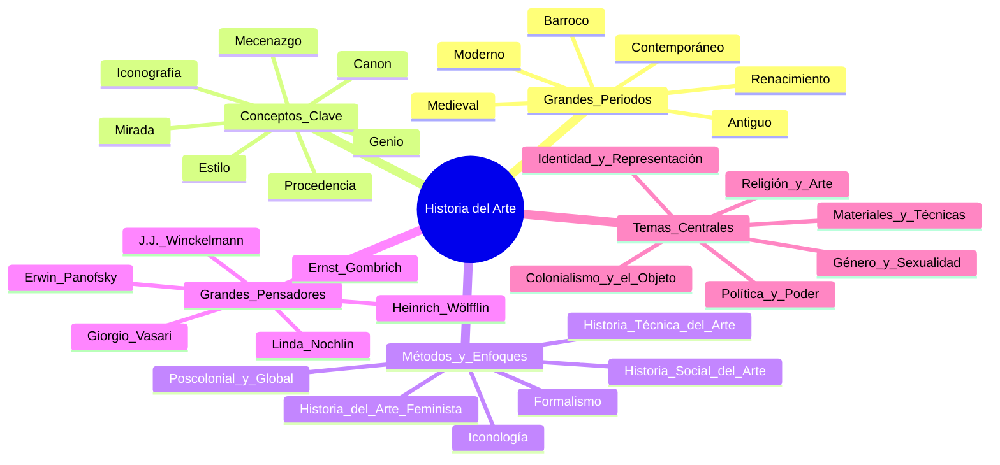

```mermaid
mindmap
  root((Historia del Arte))
    Grandes_Periodos
      Antiguo
      Medieval
      Renacimiento
      Barroco
      Moderno
      Contemporáneo
    Conceptos_Clave
      Iconografía
      Estilo
      Mecenazgo
      Canon
      Procedencia
      Genio
      Mirada
    Métodos_y_Enfoques
      Formalismo
      Iconología
      Historia_Social_del_Arte
      Historia_del_Arte_Feminista
      Poscolonial_y_Global
      Historia_Técnica_del_Arte
    Grandes_Pensadores
      Giorgio_Vasari
      J.J._Winckelmann
      Heinrich_Wölfflin
      Erwin_Panofsky
      Ernst_Gombrich
      Linda_Nochlin
    Temas_Centrales
      Religión_y_Arte
      Política_y_Poder
      Identidad_y_Representación
      Género_y_Sexualidad
      Colonialismo_y_el_Objeto
      Materiales_y_Técnicas
```
