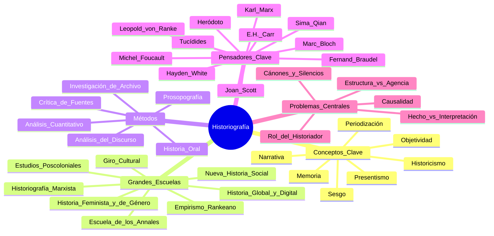

```mermaid
mindmap
  root((Historiografía))
    Conceptos_Clave
      Objetividad
      Sesgo
      Periodización
      Narrativa
      Memoria
      Historicismo
      Presentismo
    Grandes_Escuelas
      Empirismo_Rankeano
      Historiografía_Marxista
      Escuela_de_los_Annales
      Nueva_Historia_Social
      Giro_Cultural
      Estudios_Poscoloniales
      Historia_Feminista_y_de_Género
      Historia_Global_y_Digital
    Métodos
      Crítica_de_Fuentes
      Investigación_de_Archivo
      Análisis_Cuantitativo
      Historia_Oral
      Análisis_del_Discurso
      Prosopografía
    Pensadores_Clave
      Heródoto
      Tucídides
      Sima_Qian
      Leopold_von_Ranke
      Karl_Marx
      Marc_Bloch
      Fernand_Braudel
      E.H._Carr
      Michel_Foucault
      Hayden_White
      Joan_Scott
    Problemas_Centrales
      Hecho_vs_Interpretación
      Causalidad
      Estructura_vs_Agencia
      Cánones_y_Silencios
      Rol_del_Historiador
```
