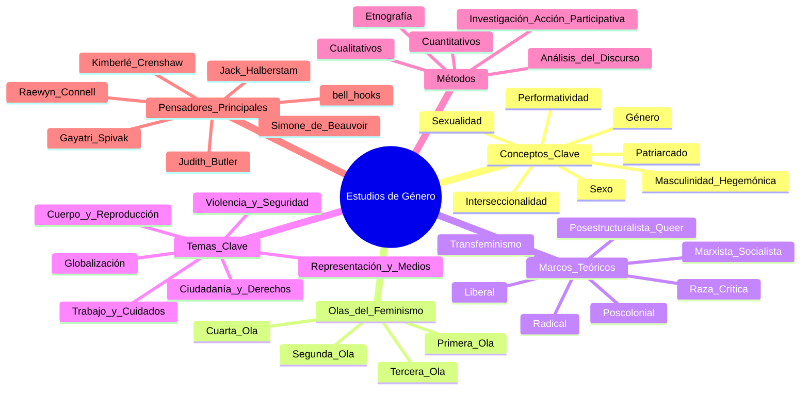

```mermaid
mindmap
  root((Estudios de Género))
    Conceptos_Clave
      Género
      Sexo
      Sexualidad
      Patriarcado
      Interseccionalidad
      Performatividad
      Masculinidad_Hegemónica
    Olas_del_Feminismo
      Primera_Ola
      Segunda_Ola
      Tercera_Ola
      Cuarta_Ola
    Marcos_Teóricos
      Liberal
      Radical
      Marxista_Socialista
      Posestructuralista_Queer
      Raza_Crítica
      Poscolonial
      Transfeminismo
    Temas_Clave
      Cuerpo_y_Reproducción
      Trabajo_y_Cuidados
      Representación_y_Medios
      Violencia_y_Seguridad
      Ciudadanía_y_Derechos
      Globalización
    Métodos
      Cualitativos
      Cuantitativos
      Análisis_del_Discurso
      Etnografía
      Investigación_Acción_Participativa
    Pensadores_Principales
      Simone_de_Beauvoir
      bell_hooks
      Judith_Butler
      Kimberlé_Crenshaw
      Gayatri_Spivak
      Raewyn_Connell
      Jack_Halberstam
```
