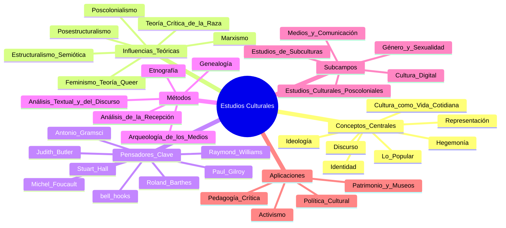

```mermaid
mindmap
  root((Estudios Culturales))
    Conceptos_Centrales
      Hegemonía
      Ideología
      Representación
      Cultura_como_Vida_Cotidiana
      Identidad
      Discurso
      Lo_Popular
    Influencias_Teóricas
      Marxismo
      Estructuralismo_Semiótica
      Posestructuralismo
      Feminismo_Teoría_Queer
      Poscolonialismo
      Teoría_Crítica_de_la_Raza
    Pensadores_Clave
      Raymond_Williams
      Stuart_Hall
      Antonio_Gramsci
      Michel_Foucault
      Roland_Barthes
      Judith_Butler
      bell_hooks
      Paul_Gilroy
    Métodos
      Análisis_Textual_y_del_Discurso
      Etnografía
      Análisis_de_la_Recepción
      Genealogía
      Arqueología_de_los_Medios
    Subcampos
      Medios_y_Comunicación
      Estudios_de_Subculturas
      Estudios_Culturales_Poscoloniales
      Género_y_Sexualidad
      Cultura_Digital
    Aplicaciones
      Pedagogía_Crítica
      Política_Cultural
      Activismo
      Patrimonio_y_Museos
```
