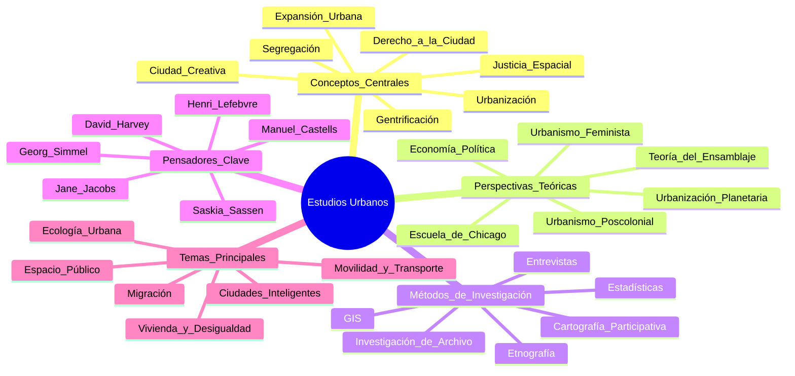

```mermaid
mindmap
  root((Estudios Urbanos))
    Conceptos_Centrales
      Urbanización
      Gentrificación
      Justicia_Espacial
      Derecho_a_la_Ciudad
      Expansión_Urbana
      Segregación
      Ciudad_Creativa
    Perspectivas_Teóricas
      Escuela_de_Chicago
      Economía_Política
      Urbanismo_Feminista
      Urbanismo_Poscolonial
      Teoría_del_Ensamblaje
      Urbanización_Planetaria
    Métodos_de_Investigación
      Etnografía
      GIS
      Entrevistas
      Estadísticas
      Investigación_de_Archivo
      Cartografía_Participativa
    Pensadores_Clave
      Georg_Simmel
      Henri_Lefebvre
      Jane_Jacobs
      David_Harvey
      Saskia_Sassen
      Manuel_Castells
    Temas_Principales
      Vivienda_y_Desigualdad
      Movilidad_y_Transporte
      Ecología_Urbana
      Ciudades_Inteligentes
      Migración
      Espacio_Público
```
