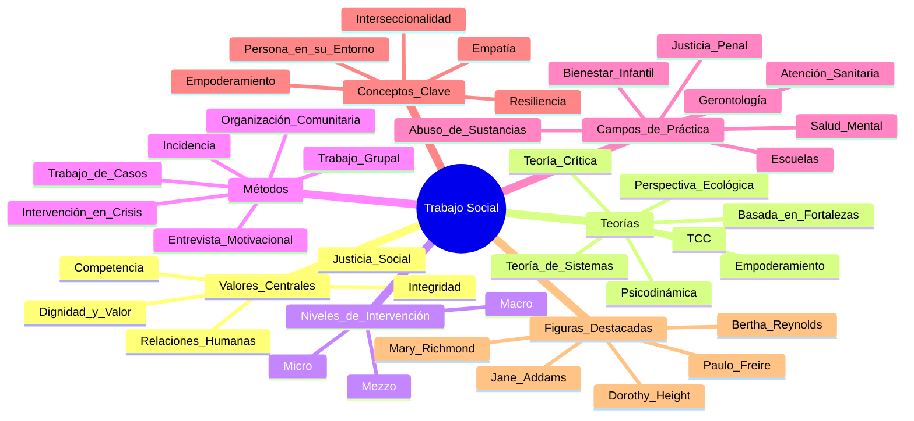

```mermaid
mindmap
  root((Trabajo Social))
    Valores_Centrales
      Justicia_Social
      Dignidad_y_Valor
      Integridad
      Competencia
      Relaciones_Humanas
    Teorías
      Teoría_de_Sistemas
      Perspectiva_Ecológica
      Basada_en_Fortalezas
      Empoderamiento
      Psicodinámica
      TCC
      Teoría_Crítica
    Niveles_de_Intervención
      Micro
      Mezzo
      Macro
    Métodos
      Trabajo_de_Casos
      Trabajo_Grupal
      Organización_Comunitaria
      Incidencia
      Intervención_en_Crisis
      Entrevista_Motivacional
    Campos_de_Práctica
      Bienestar_Infantil
      Salud_Mental
      Atención_Sanitaria
      Escuelas
      Gerontología
      Justicia_Penal
      Abuso_de_Sustancias
    Conceptos_Clave
      Persona_en_su_Entorno
      Empatía
      Empoderamiento
      Resiliencia
      Interseccionalidad
    Figuras_Destacadas
      Jane_Addams
      Mary_Richmond
      Bertha_Reynolds
      Paulo_Freire
      Dorothy_Height
```
