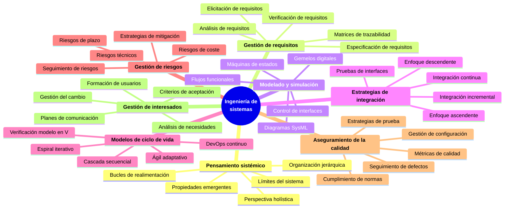

```mermaid
mindmap
  root((<b>Ingeniería de<br>sistemas</b>))
    <b>Pensamiento sistémico</b>
      Perspectiva holística
      Propiedades emergentes
      Organización jerárquica
      Límites del sistema
      Bucles de realimentación
    <b>Gestión de requisitos</b>
      Elicitación de requisitos
      Análisis de requisitos
      Especificación de requisitos
      Verificación de requisitos
      Matrices de trazabilidad
    <b>Modelado y simulación</b>
      Diagramas SysML
      Flujos funcionales
      Máquinas de estados
      Control de interfaces
      Gemelos digitales
    <b>Estrategias de integración</b>
      Integración incremental
      Enfoque descendente
      Enfoque ascendente
      Integración continua
      Pruebas de interfaces
    <b>Modelos de ciclo de vida</b>
      Cascada secuencial
      Verificación modelo en V
      Espiral iterativo
      Ágil adaptativo
      DevOps continuo
    <b>Gestión de riesgos</b>
      Riesgos técnicos
      Riesgos de plazo
      Riesgos de coste
      Estrategias de mitigación
      Seguimiento de riesgos
    <b>Aseguramiento de la calidad</b>
      Cumplimiento de normas
      Gestión de configuración
      Estrategias de prueba
      Seguimiento de defectos
      Métricas de calidad
    <b>Gestión de interesados</b>
      Análisis de necesidades
      Planes de comunicación
      Gestión del cambio
      Criterios de aceptación
      Formación de usuarios
```
