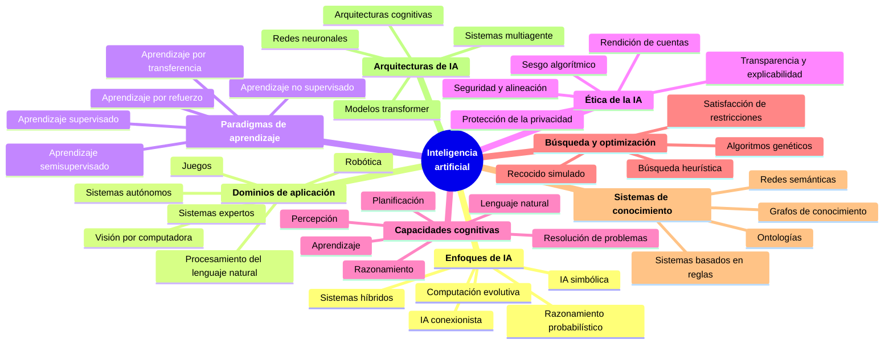

```mermaid
mindmap
  root((<b>Inteligencia<br>artificial</b>))
    <b>Enfoques de IA</b>
      IA simbólica
      IA conexionista
      Computación evolutiva
      Razonamiento probabilístico
      Sistemas híbridos
    <b>Dominios de aplicación</b>
      Visión por computadora
      Procesamiento del lenguaje natural
      Robótica
      Sistemas expertos
      Juegos
      Sistemas autónomos
    <b>Paradigmas de aprendizaje</b>
      Aprendizaje supervisado
      Aprendizaje no supervisado
      Aprendizaje por refuerzo
      Aprendizaje semisupervisado
      Aprendizaje por transferencia
    <b>Ética de la IA</b>
      Sesgo algorítmico
      Protección de la privacidad
      Transparencia y explicabilidad
      Rendición de cuentas
      Seguridad y alineación
    <b>Capacidades cognitivas</b>
      Percepción
      Razonamiento
      Aprendizaje
      Planificación
      Lenguaje natural
      Resolución de problemas
    <b>Búsqueda y optimización</b>
      Búsqueda heurística
      Satisfacción de restricciones
      Algoritmos genéticos
      Recocido simulado
    <b>Sistemas de conocimiento</b>
      Ontologías
      Redes semánticas
      Sistemas basados en reglas
      Grafos de conocimiento
    <b>Arquitecturas de IA</b>
      Redes neuronales
      Modelos transformer
      Arquitecturas cognitivas
      Sistemas multiagente
```
