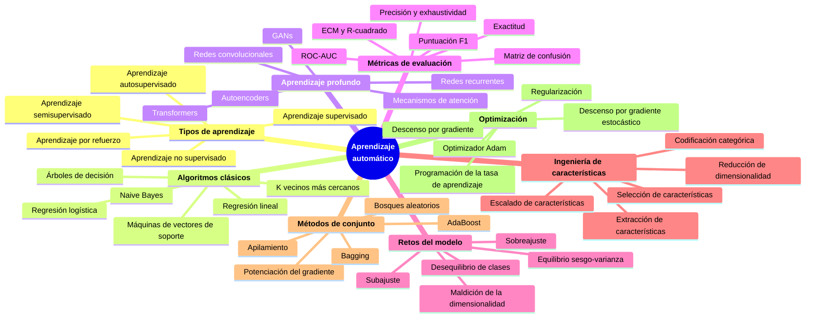

```mermaid
mindmap
  root((<b>Aprendizaje<br>automático</b>))
    <b>Tipos de aprendizaje</b>
      Aprendizaje supervisado
      Aprendizaje no supervisado
      Aprendizaje por refuerzo
      Aprendizaje semisupervisado
      Aprendizaje autosupervisado
    <b>Algoritmos clásicos</b>
      Regresión lineal
      Regresión logística
      Árboles de decisión
      Máquinas de vectores de soporte
      K vecinos más cercanos
      Naive Bayes
    <b>Aprendizaje profundo</b>
      Redes convolucionales
      Redes recurrentes
      Transformers
      GANs
      Autoencoders
      Mecanismos de atención
    <b>Métricas de evaluación</b>
      Exactitud
      Precisión y exhaustividad
      Puntuación F1
      ROC-AUC
      ECM y R-cuadrado
      Matriz de confusión
    <b>Retos del modelo</b>
      Sobreajuste
      Subajuste
      Equilibrio sesgo-varianza
      Maldición de la dimensionalidad
      Desequilibrio de clases
    <b>Ingeniería de características</b>
      Selección de características
      Extracción de características
      Reducción de dimensionalidad
      Escalado de características
      Codificación categórica
    <b>Métodos de conjunto</b>
      Bosques aleatorios
      Potenciación del gradiente
      Bagging
      Apilamiento
      AdaBoost
    <b>Optimización</b>
      Descenso por gradiente
      Descenso por gradiente estocástico
      Optimizador Adam
      Programación de la tasa de aprendizaje
      Regularización
```
