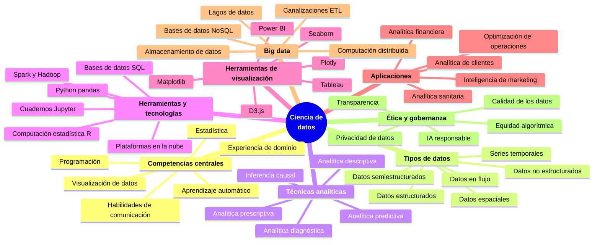

```mermaid
mindmap
  root((<b>Ciencia de<br>datos</b>))
    <b>Competencias centrales</b>
      Estadística
      Programación
      Aprendizaje automático
      Visualización de datos
      Experiencia de dominio
      Habilidades de comunicación
    <b>Tipos de datos</b>
      Datos estructurados
      Datos semiestructurados
      Datos no estructurados
      Series temporales
      Datos en flujo
      Datos espaciales
    <b>Técnicas analíticas</b>
      Analítica descriptiva
      Analítica diagnóstica
      Analítica predictiva
      Analítica prescriptiva
      Inferencia causal
    <b>Herramientas y tecnologías</b>
      Python pandas
      Computación estadística R
      Bases de datos SQL
      Spark y Hadoop
      Plataformas en la nube
      Cuadernos Jupyter
    <b>Herramientas de visualización</b>
      Tableau
      Power BI
      Matplotlib
      Seaborn
      D3.js
      Plotly
    <b>Aplicaciones</b>
      Analítica de clientes
      Analítica financiera
      Analítica sanitaria
      Optimización de operaciones
      Inteligencia de marketing
    <b>Big data</b>
      Computación distribuida
      Lagos de datos
      Bases de datos NoSQL
      Almacenamiento de datos
      Canalizaciones ETL
    <b>Ética y gobernanza</b>
      Privacidad de datos
      Equidad algorítmica
      Transparencia
      IA responsable
      Calidad de los datos
```
