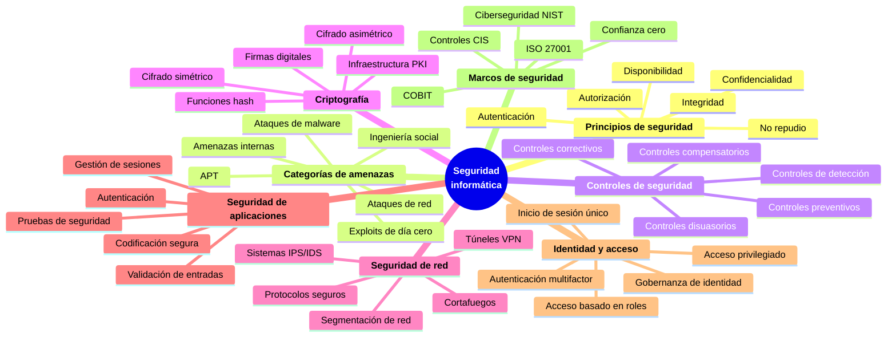

```mermaid
mindmap
  root((<b>Seguridad<br>informática</b>))
    <b>Principios de seguridad</b>
      Confidencialidad
      Integridad
      Disponibilidad
      Autenticación
      No repudio
      Autorización
    <b>Categorías de amenazas</b>
      Ataques de malware
      Ingeniería social
      Ataques de red
      Amenazas internas
      APT
      Exploits de día cero
    <b>Controles de seguridad</b>
      Controles preventivos
      Controles de detección
      Controles correctivos
      Controles disuasorios
      Controles compensatorios
    <b>Criptografía</b>
      Cifrado simétrico
      Cifrado asimétrico
      Funciones hash
      Firmas digitales
      Infraestructura PKI
    <b>Seguridad de red</b>
      Cortafuegos
      Túneles VPN
      Sistemas IPS/IDS
      Segmentación de red
      Protocolos seguros
    <b>Seguridad de aplicaciones</b>
      Codificación segura
      Validación de entradas
      Autenticación
      Gestión de sesiones
      Pruebas de seguridad
    <b>Identidad y acceso</b>
      Autenticación multifactor
      Inicio de sesión único
      Acceso basado en roles
      Acceso privilegiado
      Gobernanza de identidad
    <b>Marcos de seguridad</b>
      Ciberseguridad NIST
      ISO 27001
      Controles CIS
      COBIT
      Confianza cero
```
