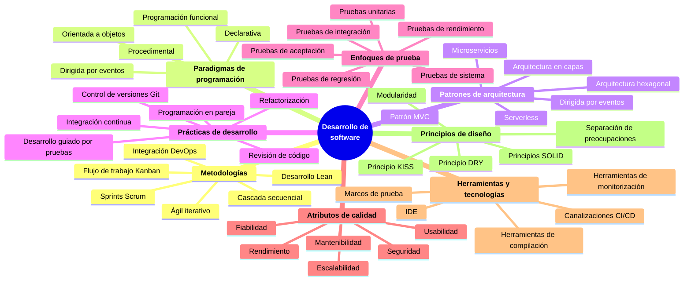

```mermaid
mindmap
  root((<b>Desarrollo de<br>software</b>))
    <b>Metodologías</b>
      Cascada secuencial
      Ágil iterativo
      Sprints Scrum
      Flujo de trabajo Kanban
      Integración DevOps
      Desarrollo Lean
    <b>Paradigmas de programación</b>
      Orientada a objetos
      Programación funcional
      Procedimental
      Declarativa
      Dirigida por eventos
    <b>Patrones de arquitectura</b>
      Arquitectura en capas
      Microservicios
      Patrón MVC
      Dirigida por eventos
      Serverless
      Arquitectura hexagonal
    <b>Prácticas de desarrollo</b>
      Control de versiones Git
      Revisión de código
      Integración continua
      Desarrollo guiado por pruebas
      Programación en pareja
      Refactorización
    <b>Enfoques de prueba</b>
      Pruebas unitarias
      Pruebas de integración
      Pruebas de sistema
      Pruebas de aceptación
      Pruebas de regresión
      Pruebas de rendimiento
    <b>Atributos de calidad</b>
      Rendimiento
      Escalabilidad
      Mantenibilidad
      Seguridad
      Fiabilidad
      Usabilidad
    <b>Herramientas y tecnologías</b>
      IDE
      Herramientas de compilación
      Marcos de prueba
      Canalizaciones CI/CD
      Herramientas de monitorización
    <b>Principios de diseño</b>
      Principios SOLID
      Principio DRY
      Principio KISS
      Separación de preocupaciones
      Modularidad
```
