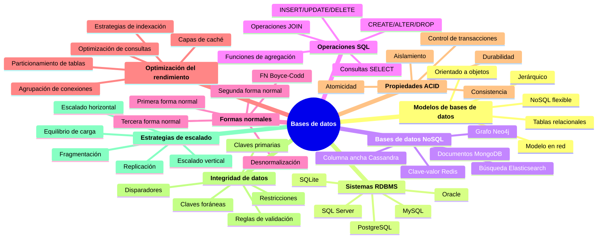

```mermaid
mindmap
  root((<b>Bases de datos</b>))
    <b>Modelos de bases de datos</b>
      Tablas relacionales
      NoSQL flexible
      Orientado a objetos
      Jerárquico
      Modelo en red
    <b>Sistemas RDBMS</b>
      Oracle
      MySQL
      PostgreSQL
      SQL Server
      SQLite
    <b>Bases de datos NoSQL</b>
      Documentos MongoDB
      Columna ancha Cassandra
      Clave-valor Redis
      Grafo Neo4j
      Búsqueda Elasticsearch
    <b>Operaciones SQL</b>
      Consultas SELECT
      INSERT/UPDATE/DELETE
      CREATE/ALTER/DROP
      Operaciones JOIN
      Funciones de agregación
    <b>Formas normales</b>
      Primera forma normal
      Segunda forma normal
      Tercera forma normal
      FN Boyce-Codd
      Desnormalización
    <b>Optimización del rendimiento</b>
      Estrategias de indexación
      Optimización de consultas
      Particionamiento de tablas
      Capas de caché
      Agrupación de conexiones
    <b>Propiedades ACID</b>
      Atomicidad
      Consistencia
      Aislamiento
      Durabilidad
      Control de transacciones
    <b>Integridad de datos</b>
      Claves primarias
      Claves foráneas
      Restricciones
      Disparadores
      Reglas de validación
    <b>Estrategias de escalado</b>
      Escalado vertical
      Escalado horizontal
      Replicación
      Fragmentación
      Equilibrio de carga
```
