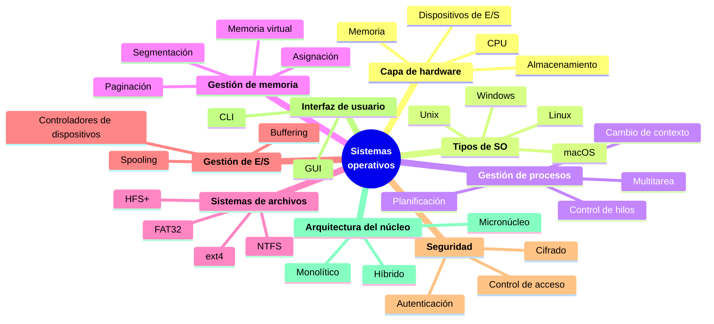

```mermaid
mindmap
  root((<b>Sistemas<br>operativos</b>))
    <b>Capa de hardware</b>
      CPU
      Memoria
      Almacenamiento
      Dispositivos de E/S
    <b>Tipos de SO</b>
      Windows
      Linux
      macOS
      Unix
    <b>Gestión de procesos</b>
      Planificación
      Multitarea
      Control de hilos
      Cambio de contexto
    <b>Gestión de memoria</b>
      Memoria virtual
      Paginación
      Segmentación
      Asignación
    <b>Sistemas de archivos</b>
      NTFS
      ext4
      FAT32
      HFS+
    <b>Gestión de E/S</b>
      Controladores de dispositivos
      Buffering
      Spooling
    <b>Seguridad</b>
      Autenticación
      Control de acceso
      Cifrado
    <b>Interfaz de usuario</b>
      GUI
      CLI
    <b>Arquitectura del núcleo</b>
      Monolítico
      Micronúcleo
      Híbrido
```
