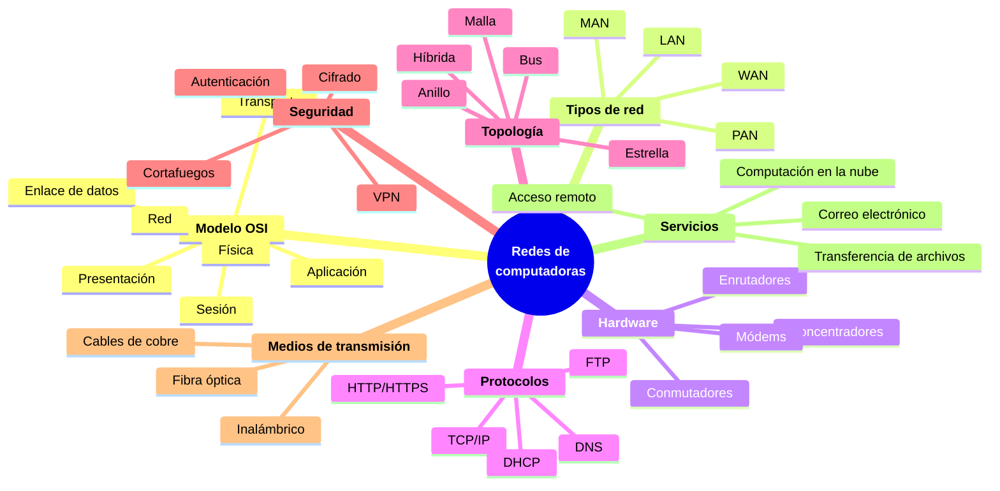

```mermaid
mindmap
  root((<b>Redes de<br>computadoras</b>))
    <b>Modelo OSI</b>
      Física
      Enlace de datos
      Red
      Transporte
      Sesión
      Presentación
      Aplicación
    <b>Tipos de red</b>
      LAN
      WAN
      MAN
      PAN
    <b>Hardware</b>
      Enrutadores
      Conmutadores
      Concentradores
      Módems
    <b>Protocolos</b>
      TCP/IP
      HTTP/HTTPS
      FTP
      DNS
      DHCP
    <b>Topología</b>
      Estrella
      Anillo
      Malla
      Bus
      Híbrida
    <b>Seguridad</b>
      Cortafuegos
      VPN
      Cifrado
      Autenticación
    <b>Medios de transmisión</b>
      Cables de cobre
      Fibra óptica
      Inalámbrico
    <b>Servicios</b>
      Correo electrónico
      Transferencia de archivos
      Acceso remoto
      Computación en la nube
```
