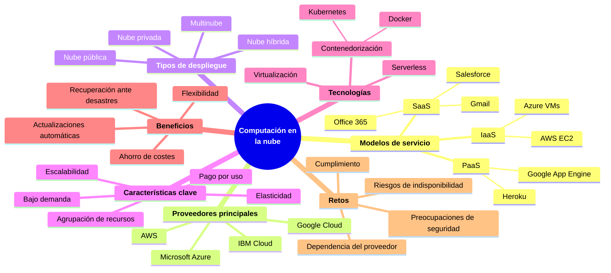

```mermaid
mindmap
  root((<b>Computación en<br>la nube</b>))
    <b>Modelos de servicio</b>
      IaaS
        AWS EC2
        Azure VMs
      PaaS
        Google App Engine
        Heroku
      SaaS
        Gmail
        Salesforce
        Office 365
    <b>Proveedores principales</b>
      AWS
      Microsoft Azure
      Google Cloud
      IBM Cloud
    <b>Tipos de despliegue</b>
      Nube pública
      Nube privada
      Nube híbrida
      Multinube
    <b>Características clave</b>
      Elasticidad
      Escalabilidad
      Pago por uso
      Agrupación de recursos
      Bajo demanda
    <b>Tecnologías</b>
      Virtualización
      Contenedorización
        Docker
        Kubernetes
      Serverless
    <b>Beneficios</b>
      Ahorro de costes
      Flexibilidad
      Recuperación ante desastres
      Actualizaciones automáticas
    <b>Retos</b>
      Preocupaciones de seguridad
      Dependencia del proveedor
      Cumplimiento
      Riesgos de indisponibilidad
```
