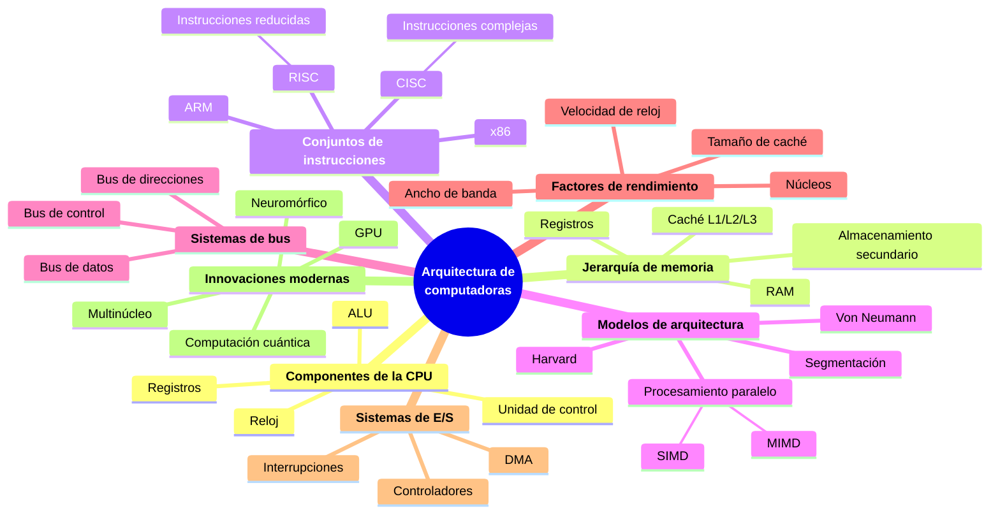

```mermaid
mindmap
  root((<b>Arquitectura de<br>computadoras</b>))
    <b>Componentes de la CPU</b>
      ALU
      Unidad de control
      Registros
      Reloj
    <b>Jerarquía de memoria</b>
      Registros
      Caché L1/L2/L3
      RAM
      Almacenamiento secundario
    <b>Conjuntos de instrucciones</b>
      CISC
        Instrucciones complejas
      RISC
        Instrucciones reducidas
      ARM
      x86
    <b>Modelos de arquitectura</b>
      Von Neumann
      Harvard
      Segmentación
      Procesamiento paralelo
        SIMD
        MIMD
    <b>Sistemas de bus</b>
      Bus de datos
      Bus de direcciones
      Bus de control
    <b>Factores de rendimiento</b>
      Velocidad de reloj
      Núcleos
      Tamaño de caché
      Ancho de banda
    <b>Sistemas de E/S</b>
      Interrupciones
      DMA
      Controladores
    <b>Innovaciones modernas</b>
      Multinúcleo
      GPU
      Computación cuántica
      Neuromórfico
```
