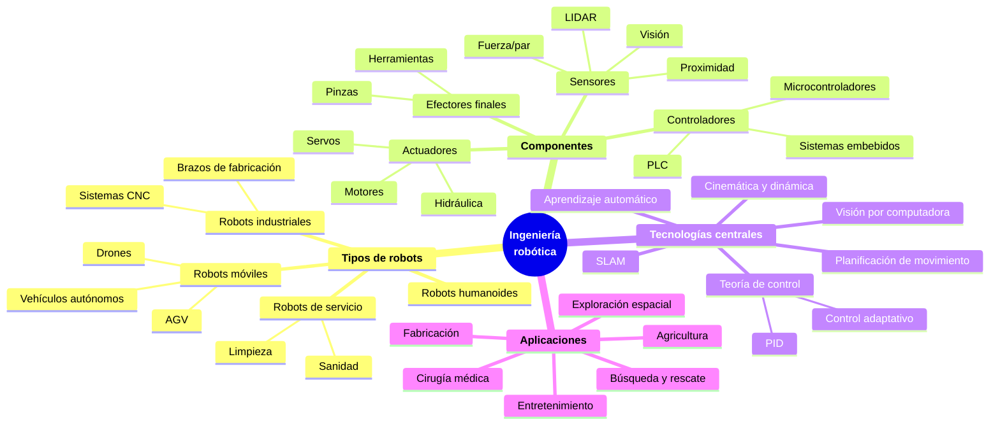

```mermaid
mindmap
  root((<b>Ingeniería<br>robótica</b>))
    <b>Tipos de robots</b>
      Robots industriales
        Brazos de fabricación
        Sistemas CNC
      Robots de servicio
        Limpieza
        Sanidad
      Robots móviles
        Vehículos autónomos
        Drones
        AGV
      Robots humanoides
    <b>Componentes</b>
      Actuadores
        Motores
        Servos
        Hidráulica
      Sensores
        Visión
        LIDAR
        Proximidad
        Fuerza/par
      Controladores
        PLC
        Microcontroladores
        Sistemas embebidos
      Efectores finales
        Pinzas
        Herramientas
    <b>Tecnologías centrales</b>
      Cinemática y dinámica
      Teoría de control
        PID
        Control adaptativo
      Visión por computadora
      Aprendizaje automático
      SLAM
      Planificación de movimiento
    <b>Aplicaciones</b>
      Fabricación
      Cirugía médica
      Exploración espacial
      Agricultura
      Búsqueda y rescate
      Entretenimiento
```
