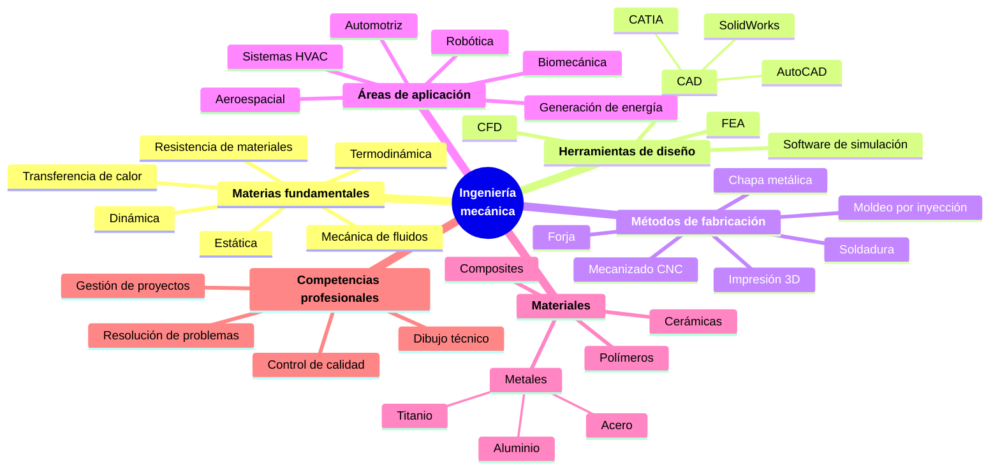

```mermaid
mindmap
  root((<b>Ingeniería<br>mecánica</b>))
    <b>Materias fundamentales</b>
      Estática
      Dinámica
      Mecánica de fluidos
      Termodinámica
      Transferencia de calor
      Resistencia de materiales
    <b>Herramientas de diseño</b>
      CAD
        SolidWorks
        AutoCAD
        CATIA
      FEA
      CFD
      Software de simulación
    <b>Métodos de fabricación</b>
      Mecanizado CNC
      Impresión 3D
      Soldadura
      Forja
      Moldeo por inyección
      Chapa metálica
    <b>Áreas de aplicación</b>
      Automotriz
      Aeroespacial
      Sistemas HVAC
      Generación de energía
      Robótica
      Biomecánica
    <b>Materiales</b>
      Metales
        Acero
        Aluminio
        Titanio
      Composites
      Polímeros
      Cerámicas
    <b>Competencias profesionales</b>
      Resolución de problemas
      Gestión de proyectos
      Dibujo técnico
      Control de calidad
```
