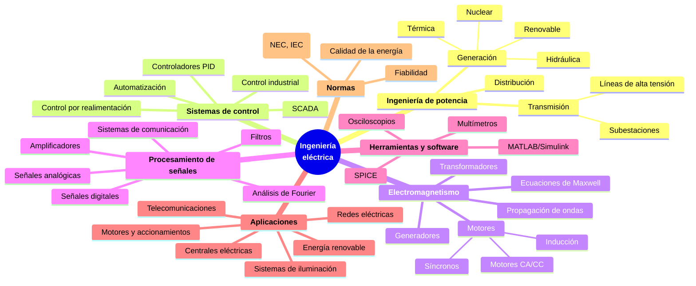

```mermaid
mindmap
  root((<b>Ingeniería<br>eléctrica</b>))
    <b>Ingeniería de potencia</b>
      Generación
        Térmica
        Hidráulica
        Nuclear
        Renovable
      Transmisión
        Líneas de alta tensión
        Subestaciones
      Distribución
    <b>Sistemas de control</b>
      Control por realimentación
      Automatización
      Controladores PID
      SCADA
      Control industrial
    <b>Electromagnetismo</b>
      Ecuaciones de Maxwell
      Propagación de ondas
      Motores
        Motores CA/CC
        Inducción
        Síncronos
      Generadores
      Transformadores
    <b>Procesamiento de señales</b>
      Señales analógicas
      Señales digitales
      Análisis de Fourier
      Filtros
      Amplificadores
      Sistemas de comunicación
    <b>Herramientas y software</b>
      SPICE
      MATLAB/Simulink
      Osciloscopios
      Multímetros
    <b>Aplicaciones</b>
      Centrales eléctricas
      Redes eléctricas
      Motores y accionamientos
      Telecomunicaciones
      Sistemas de iluminación
      Energía renovable
    <b>Normas</b>
      Seguridad (NEC, IEC)
      Calidad de la energía
      Fiabilidad
```
