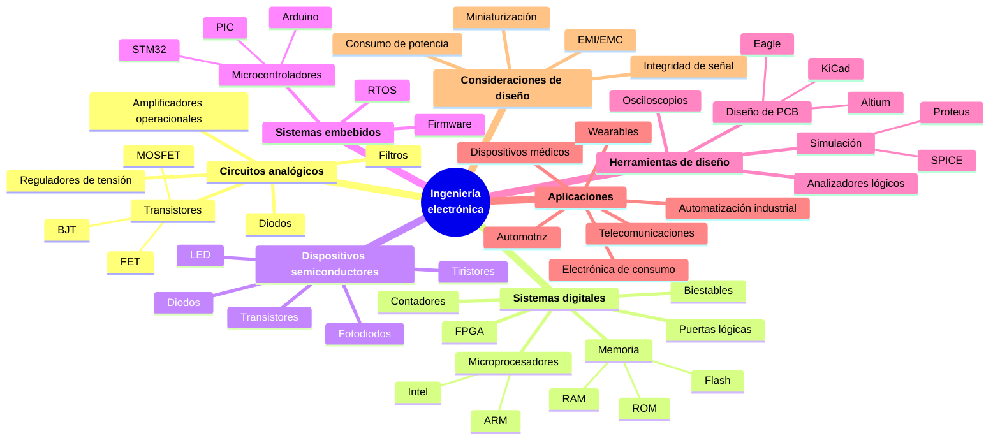

```mermaid
mindmap
  root((<b>Ingeniería<br>electrónica</b>))
    <b>Circuitos analógicos</b>
      Amplificadores operacionales
      Transistores
        BJT
        FET
        MOSFET
      Diodos
      Reguladores de tensión
      Filtros
    <b>Sistemas digitales</b>
      Puertas lógicas
      Biestables
      Contadores
      Microprocesadores
        Intel
        ARM
      FPGA
      Memoria
        RAM
        ROM
        Flash
    <b>Dispositivos semiconductores</b>
      Diodos
      Transistores
      LED
      Fotodiodos
      Tiristores
    <b>Sistemas embebidos</b>
      Microcontroladores
        Arduino
        PIC
        STM32
      RTOS
      Firmware
    <b>Herramientas de diseño</b>
      Diseño de PCB
        Altium
        Eagle
        KiCad
      Simulación
        SPICE
        Proteus
      Osciloscopios
      Analizadores lógicos
    <b>Aplicaciones</b>
      Electrónica de consumo
      Telecomunicaciones
      Dispositivos médicos
      Automotriz
      Automatización industrial
      Wearables
    <b>Consideraciones de diseño</b>
      Consumo de potencia
      Integridad de señal
      EMI/EMC
      Miniaturización
```
