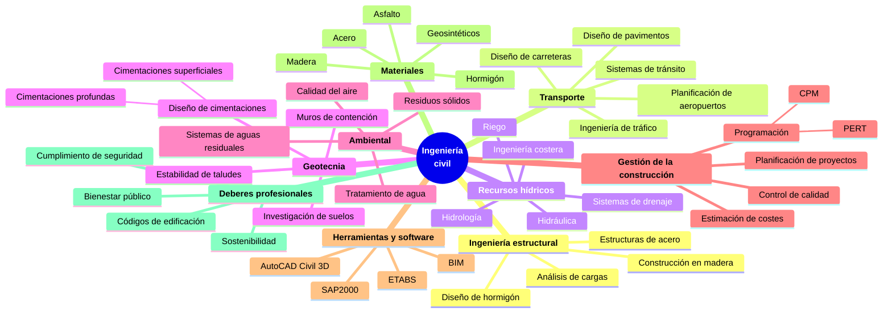

```mermaid
mindmap
  root((<b>Ingeniería<br>civil</b>))
    <b>Ingeniería estructural</b>
      Estructuras de acero
      Diseño de hormigón
      Construcción en madera
      Análisis de cargas
    <b>Transporte</b>
      Diseño de carreteras
      Ingeniería de tráfico
      Diseño de pavimentos
      Sistemas de tránsito
      Planificación de aeropuertos
    <b>Recursos hídricos</b>
      Hidráulica
      Hidrología
      Sistemas de drenaje
      Riego
      Ingeniería costera
    <b>Geotecnia</b>
      Investigación de suelos
      Diseño de cimentaciones
        Cimentaciones superficiales
        Cimentaciones profundas
      Muros de contención
      Estabilidad de taludes
    <b>Ambiental</b>
      Tratamiento de agua
      Sistemas de aguas residuales
      Residuos sólidos
      Calidad del aire
    <b>Gestión de la construcción</b>
      Planificación de proyectos
      Programación
        CPM
        PERT
      Estimación de costes
      Control de calidad
    <b>Herramientas y software</b>
      AutoCAD Civil 3D
      SAP2000
      ETABS
      BIM
    <b>Materiales</b>
      Hormigón
      Acero
      Asfalto
      Madera
      Geosintéticos
    <b>Deberes profesionales</b>
      Cumplimiento de seguridad
      Códigos de edificación
      Sostenibilidad
      Bienestar público
```
