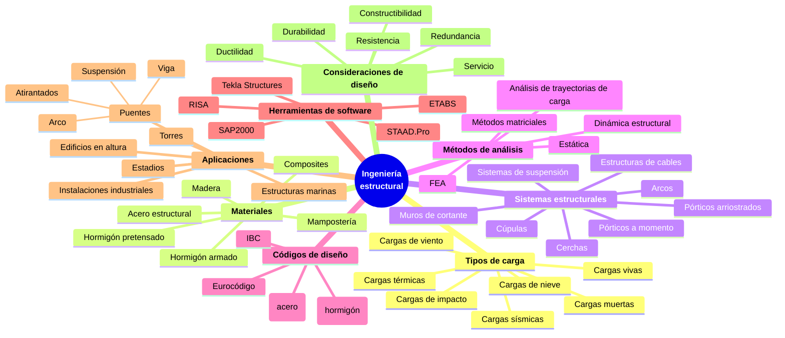

```mermaid
mindmap
  root((<b>Ingeniería<br>estructural</b>))
    <b>Tipos de carga</b>
      Cargas muertas
      Cargas vivas
      Cargas de viento
      Cargas sísmicas
      Cargas de nieve
      Cargas de impacto
      Cargas térmicas
    <b>Materiales</b>
      Hormigón armado
      Acero estructural
      Hormigón pretensado
      Madera
      Mampostería
      Composites
    <b>Sistemas estructurales</b>
      Pórticos a momento
      Pórticos arriostrados
      Muros de cortante
      Cerchas
      Arcos
      Cúpulas
      Sistemas de suspensión
      Estructuras de cables
    <b>Métodos de análisis</b>
      Estática
      Dinámica estructural
      FEA
      Métodos matriciales
      Análisis de trayectorias de carga
    <b>Códigos de diseño</b>
      ACI (hormigón)
      AISC (acero)
      IBC
      Eurocódigo
    <b>Herramientas de software</b>
      SAP2000
      ETABS
      STAAD.Pro
      RISA
      Tekla Structures
    <b>Aplicaciones</b>
      Edificios en altura
      Puentes
        Viga
        Arco
        Suspensión
        Atirantados
      Estadios
      Torres
      Instalaciones industriales
      Estructuras marinas
    <b>Consideraciones de diseño</b>
      Resistencia
      Servicio
      Ductilidad
      Redundancia
      Durabilidad
      Constructibilidad
```
