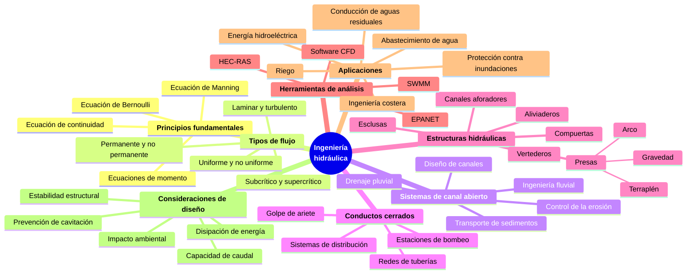

```mermaid
mindmap
  root((<b>Ingeniería<br>hidráulica</b>))
    <b>Principios fundamentales</b>
      Ecuación de continuidad
      Ecuación de Bernoulli
      Ecuación de Manning
      Ecuaciones de momento
    <b>Tipos de flujo</b>
      Laminar y turbulento
      Permanente y no permanente
      Uniforme y no uniforme
      Subcrítico y supercrítico
    <b>Sistemas de canal abierto</b>
      Ingeniería fluvial
      Diseño de canales
      Drenaje pluvial
      Transporte de sedimentos
      Control de la erosión
    <b>Conductos cerrados</b>
      Redes de tuberías
      Estaciones de bombeo
      Golpe de ariete
      Sistemas de distribución
    <b>Estructuras hidráulicas</b>
      Presas
        Gravedad
        Arco
        Terraplén
      Aliviaderos
      Compuertas
      Vertederos
      Canales aforadores
      Esclusas
    <b>Herramientas de análisis</b>
      HEC-RAS
      SWMM
      EPANET
      Software CFD
    <b>Aplicaciones</b>
      Abastecimiento de agua
      Riego
      Protección contra inundaciones
      Energía hidroeléctrica
      Conducción de aguas residuales
      Ingeniería costera
    <b>Consideraciones de diseño</b>
      Capacidad de caudal
      Disipación de energía
      Prevención de cavitación
      Estabilidad estructural
      Impacto ambiental
```
